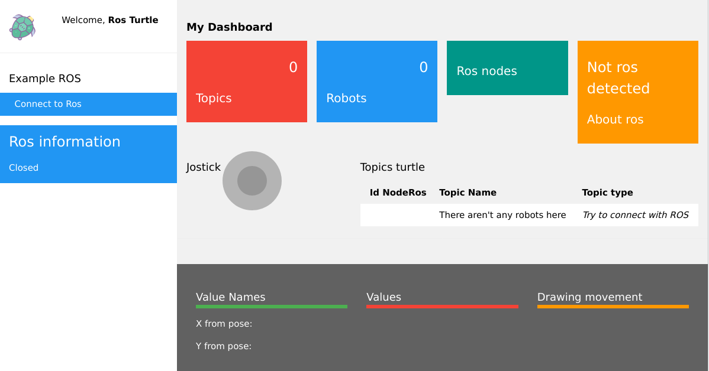

<h2 align="center">ROS KINETIC + DOCKER</h2>

___

<p align="center">
  
</p>


<h3 align="center">
  <a href="#information_source-summary">Summary</a>&nbsp;|&nbsp;
  <a href="#interrobang-reason">Reason</a>&nbsp;|&nbsp;
  <a href="#seedling-requeriments">Requeriments</a>&nbsp;|&nbsp;
  <a href="#rocket-technologies-used">Technologies Used</a>&nbsp;|&nbsp;
  <a href="#triangular_ruler-directory-structure">Directory Structure</a>&nbsp;|&nbsp;
  <a href="#whale2-about-project">About Project</a>&nbsp;|&nbsp;
</h3>


___


## :information_source: Summary

A simple example about how you can create a docker beside ROS using 'TURLESIM.  This small project has used 'ROS Kinetic' because it is still applied in couple sectors of industry due to its package compatibilities.

## :interrobang: Reason

The goal is to be able to achieve a tool to start with ROS without worrying about what version of Linux to use or what package it must be installed. 

If you want some example with gazebo or UR Robot, please you should take a look to in the folder named **misitio_ros_ur**.

## :seedling: Requeriments

- **Linux:** Docker CE/EE 18.06+ and Docker Compose 1.21+. *The snap version in Ubuntu 18.04 won’t do!* Trust me, I’ve tried.
- **Windows** Docker Desktop 2.0+

## :rocket: Technologies Used

The list of technologies used in this small project:

- ROS Kinetic and [Roslibjs library](http://wiki.ros.org/roslibjs)
- Docker

## :triangular_ruler: Directory Structure

The structure about this small project and the default ROS workspace structure somewhere on your computer like so.

```
 |__hostfolder
 |__catkin_ws  #ROS WORKSPACE  
 │
 └───src
 |    │___your_ros_pkgs
 |    │   
 |    │
 |    └───docker-setup.sh
 | 
 |__Dockerfile
 |__ros_entypoint.sh
```

## :whale2: About Project

#### Table of Contents
- [Docker](#Docker)
  - [Dockerfile](#dockerfile)
  - [Build Docker](#build-docker)
  - [Run Docker](#run-docker)
- [Step Launch](#step-launch)
  - [Start ROS project example](#start-ros-project-example)	


### Docker


#### Dockerfile

```dockerfile
FROM ros:kinetic
LABEL maintainer "Manuel Martinez"

SHELL ["/bin/bash","-c"]
# Install packages
RUN sh -c 'echo "deb http://packages.ros.org/ros/ubuntu $(lsb_release -sc) main" > /etc/apt/sources.list.d/ros-latest.list' \
    && apt-key adv --keyserver hkp://keyserver.ubuntu.com:80 --recv-keys C1CF6E31E6BADE8868B172B4F42ED6FBAB17C654 \
    && apt-get update \
    && apt-get install -y \
    # Basic utilities
    iputils-ping \
    # ROS bridge server and related packages
    ros-${ROS_DISTRO}-rosbridge-server \
    ros-${ROS_DISTRO}-tf2-web-republisher \
    ros-${ROS_DISTRO}-turtle-tf2 ros-${ROS_DISTRO}-tf\
    ros-${ROS_DISTRO}-tf2-tools\
    --no-install-recommends \
    # Clear apt-cache to reduce image size
    && rm -rf /var/lib/apt/lists/*

# Create local catkin workspace
ENV CATKIN_WS=/root/catkin_ws
RUN mkdir -p $CATKIN_WS/src
WORKDIR $CATKIN_WS/src
RUN mkdir -p /root/catkin_ws/web-test

# Initialize local catkin workspace
RUN source /opt/ros/${ROS_DISTRO}/setup.bash \
    # Update apt-get because its cache is always cleared after installs to keep image size down
    && apt-get update \
    # ROS File Server
    && git clone https://github.com/gramaziokohler/ros_file_server.git \
    # Install dependencies
    && cd $CATKIN_WS \
    && rosdep install -y --from-paths . --ignore-src --rosdistro ${ROS_DISTRO} \
    # Build catkin workspace
    && catkin_make
    
RUN echo "source /root/catkin_ws/devel/setup.bash" >> /root/.bashrc
EXPOSE 11311
EXPOSE 9090
COPY ./ros_entypoint.sh /
ENTRYPOINT ["/ros_entypoint.sh"]
CMD ["bash"]
```

#### Build Docker

```
docker build --pull --rm -f "Dockerfile" -t misitioros:latest "."
```


#### Run Docker

Before to run docker, the first step is to create a network. Docker Engine it creates a `bridge` network automatically. This network corresponds to the `docker0` bridge that Engine has traditionally relied on. When you launch a new container with `docker run` it automatically connects to this bridge network. You cannot remove this default bridge network, but you can create new ones using the `network create` command.

```
sudo docker network create --subnet=172.18.0.0/16 mynetROS
```

Bridge networks are isolated networks on a single Engine installation. If you want to create a network that spans multiple Docker hosts each running an Engine, you must create an `overlay` network. 

```shell
#!/bin/bash
NAME_IMAGE=misitioros:latest
NAME_CONTAINER=ros_turtleweb

sudo docker run -it   -v ${PWD}/hostfolder/catkin_ws/src/web-test:/root/catkin_ws/src/web-test -w /root/catkin_ws/src -p 9090:9090 -p 11311:11311/tcp \
    --net mynetROS -h turtleweb --ip 172.18.0.22\
    --env PORTSERVER=8001\
    --env ROS_HOSTNAME=turtleweb \
    --env ROS_MASTER_URI=http://turtleweb:11311 \
    --privileged\
    --security-opt label=disable\
    --security-opt seccomp=unconfined\
    --env="DISPLAY" --env QT_X11_NO_MITSHM=1\
    --volume="/tmp/.X11-unix:/tmp/.X11-unix:rw"\
    --name=$NAME_CONTAINER $NAME_IMAGE
    
```

- /hostfolder contains the sample project based on roslibjs and html, thanks to use [VOLUMEN](https://docs.docker.com/engine/reference/commandline/volume_create/) we can shared local project to docker and modify it locally.

- The display acces it available for Intel graphics

  

### Step Launch


#### Create docker image

```
sudo docker build -t misitioros:latest
```

Before launching a docker , if we want to have display acces then we need Host-based Control (xhost) that is used to add and delete host names or user names to the list allowed to make connections to the X server.

```
 xhost +local:docker 
```

Once the command above has been launched then we can use `.launch.sh` file that contains a docker run command.

It's advisable to use [Docker for VSCODE](https://github.com/microsoft/vscode-docker) , This extension make it easy to build, manage, and deploy containerezed applications.

Here an image with our example project using the named extension


#### Start Container

```
./launch.sh
```

It's important to highlight that when the coker image run with CMD we can define a the default executable, the container runs the process specified by the CMD command. it only applies the instructions from the last one.

```shell
#!/bin/bash
set -e

# setup ros environment
# Source ROS distro environment and local catwin workspace
source "/opt/ros/$ROS_DISTRO/setup.bash" && source "$CATKIN_WS/devel/setup.bash"

# setup workspace if it exists
if [ -n "$WORKSPACE_NAME" ]; then
    if [ ! -e "/root/$WORKSPACE_NAME/devel/setup.sh" ]; then
        previousDirectory=$(pwd)
        cd /root/$WORKSPACE_NAME
        catkin_make
        cd $previousDirectory
    fi
    source "/root/$WORKSPACE_NAME/devel/setup.sh"
    echo "/root/$WORKSPACE_NAME"

fi
if [ -e "/root/$WORKSPACE_NAME/src/web-test/server.py" ]; then
    python3 /root/$WORKSPACE_NAME/src/web-test/server.py &>/dev/null &
    pid=$! #Running a Python SimpleHTTPServer in the background
    # Stop server: kill "${pid}"
fi
# to launch example project roslibjs > roslaunch web-test websocket.launch
exec "$@"
```

When this docker container starts the script above launches and creates a http server via python, thanks to this we can access at the example web with roslibjs library: http://localhost:8001/

Here an example of the launching:



On this screenshot it can be observed that there isn't any information about nodes or topics. This is because the web-test project hasn't been launched yet. 

#### Start ROS project example

If it takes a quick look to launching file we can observe how to init websocket that it provides us a communication channel between ROS and WEB:

```xml
<launch>
  <!-- rosbridge_server-->
  <include file="$(find rosbridge_server)/launch/rosbridge_websocket.launch"/>

  <!-- Turtlesim Node-->
  <node pkg="turtlesim" type="turtlesim_node" name="sim"/>

  <node pkg="turtlesim" type="turtle_teleop_key" name="teleop" output="screen"/>
  <!-- Axes -->
  <param name="scale_linear" value="2" type="double"/>
  <param name="scale_angular" value="2" type="double"/>

  <node name="turtle1_tf2_broadcaster" pkg="turtle_tf2" type="turtle_tf2_broadcaster.py" respawn="false" output="screen" >
    <param name="turtle" type="string" value="turtle1" />
  </node>
  <node name="turtle2_tf2_broadcaster" pkg="turtle_tf2" type="turtle_tf2_broadcaster.py" respawn="false" output="screen" >
    <param name="turtle" type="string" value="turtle2" />
  </node>
  <node name="turtle_pointer" pkg="turtle_tf2" type="turtle_tf2_listener.py" respawn="false" output="screen" >
  </node>

</launch>
```

So, it's necessary to launch this file commented recently.  Once the container has been launched we need attach its shell. Via command:

```shell
docker exec -it <<ID CONTAINER>> /bin/sh -c "[ -e /bin/bash ] && /bin/bash || /bin/sh"
```

Via [Docker for VSCODE](https://github.com/microsoft/vscode-docker), click-right on container name and select "Attach Shell" option.


And finally, on the new terminal:

```shell
roslaunch web-test websocket.launch
```

Then if we return to the website it will be observed the next:


Remember that if we want to see turtle simulatio, we need to launch `xhost +local:docker` on terminal before.